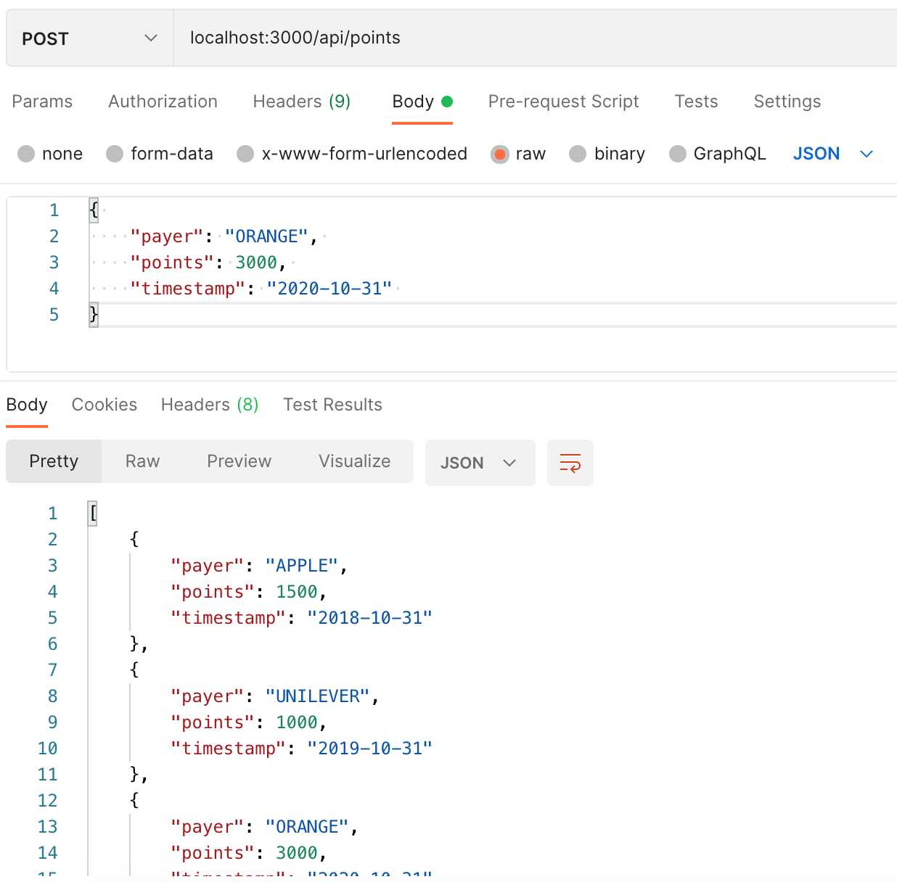
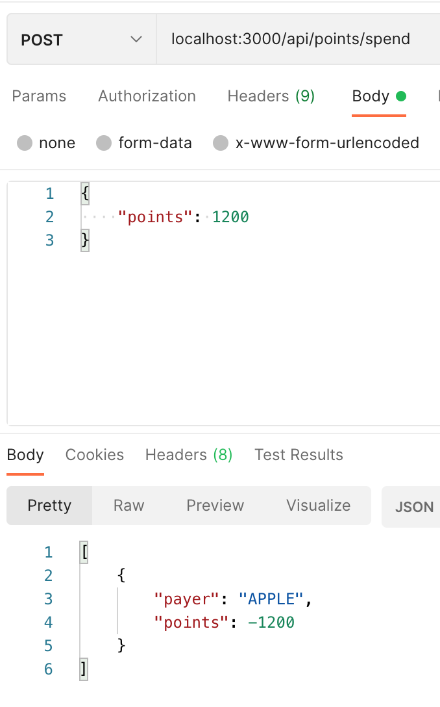
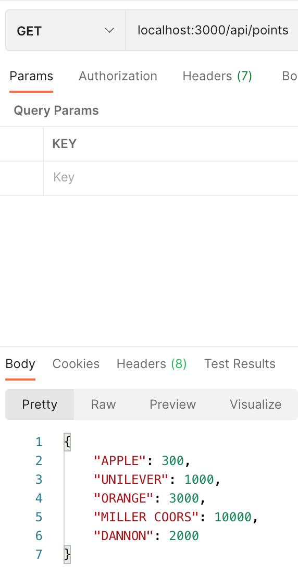

# Fetch Rewards Coding Exercise

## Objective
To write a web service that accepts HTTP requests and returns responses based on conditions, set in the background information below, for a payer/points system.

### Background
- Users have points in their accounts
- Users only see a single balance in their accounts. However, for reporting purposes User points are tracked through points per payer/partner
- Each transaction record contains: payer (string), points (integer), timestamp (date)
- When a User spends points, they don't know or care which payer the points come from. But, the accounting team does care how the points are spent
- There are two rules for determining what points to "spend" first:
  - the oldest points to be spent first (oldest based on transaction timestamp, not the order they’re received)
  - no payer's points to go negative

### Expectations of Web Server
Provide routes that:
1.  Add transactions for a specific payer and date
2. Spend points using the rules above and return a list of { "payer": string, "points": integer } for each call
3. Return all payer point balances

_Please note:_ For illustrative purposes, timestamp is in the "yyyy-mm-dd" format.

### Technologies Used
- Node.js
- Express.js
- Postman (for testing routes)

## How to Get Started
1. Fork and then clone this repo
2. In your terminal (make sure you are in the root of the repo), run:

```
 npm install
```

- This will install all necessary dependencies from the package.json file.

3. Once all dependencies are installed, in your terminal run the following custom script to start the development server:
```
 npm run dev
```
4. Once your server is running, open up Postman to test routes

### Testing Code
We will implement three routes based on the expectations listed above:

1. POST request to "/points" to add transactions for a specific payer and date
2. POST request to "/points/spend" to deduct points, based on rules listed in background section, and return a list of { "payer": string, "points": integer } for each call
3. GET request to "/points" for all payer point balances

_Please note:_ All endpoints are pre-pended with "/api". For example, in local development we would make a GET request to "localhost:3000/api/points".

Once the server is running (see "How to Get Started" section above), open up Postman to test each route.

#### Testing First Route
We start by adding several transactions. In order to add a transaction via Postman: 
1) make a POST request to the path "localhost:3000/api/points" 
2) add a body to the post request - choose the "body" tab, then select the options "raw" and "json" (screenshot below). 

Example transactions below (you may copy/paste each into postman):

```
  { "payer": "DANNON", "points": 2000, "timestamp": "2020-11-05" }
```

```
{ "payer": "UNILEVER", "points": 1000, "timestamp": "2019-10-31" }
```

```
{ "payer": "APPLE", "points": 1500, "timestamp": "2018-10-31" }
```

```
{ "payer": "MILLER COORS", "points": 10000, "timestamp": "2020-11-01" }
```

```
{ "payer": "ORANGE", "points": 3000, "timestamp": "2020-10-31" }
```

_Please note:_ Directions on how to handle duplicates were not 100% clear. One option was to list each transaction as seperate - even for the same payer. For demonstation purposes however, the option selected for duplicates was to combine the points of an already existing payer and keep original timestamp.

ScreenShot of Postman for First Route:


#### Testing Second Route
In order to spend points via Postman: 
1) make a POST request to the path "localhost:3000/api/points/spend" 
2) add a body to the post request - choose the options "raw" and "json". 

Example of body in post request below (you may copy/paste each into postman):

```
 { "points": 3000 }
```

The expected response will be a list of { "payer": string, "points": integer }

ScreenShot of Postman for Second Route:


#### Testing Third Route
1) make a GET request to the path "localhost:3000/api/points"

This will give you a print out of payers and their remaining balances.

ScreenShot of Postman for Third Route:
